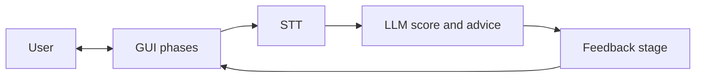

# NLP A3 — Mock Interview Coach

**[Full guide (English)](docs/en/README.md)** · **[完整說明（繁體中文）](docs/zh-TW/README.md)** · [Documentation hub](docs/README.md)

**NLP A3** is a course project for **NLP Assessment 3 (Project Development)**.  
It builds a **mock interview coaching prototype**: phased **GUI** → speech (mic; optional camera) → **open-source STT** → transcript → **LLM** scoring and suggestions → final feedback stage back to the user.

This file is the **overview** only. Architecture, tech stack, repo layout, and collaboration notes live in the language-specific guides.

---

## At-a-glance workflow

High-level path: **User → GUI (staged flow) → STT → LLM (score + advice) → feedback GUI → User.**



Optional: a backend API orchestrates STT and LLM, and may persist sessions (`DB`).

---

## Run the UI (Phase 1 scaffold)

```bash
cd frontend && npm install && npm run dev
```

Opens the staged interview flow with **mock** STT/LLM (no backend yet). See the language guides for full stack notes.

---

## Documentation

| | |
|--|--|
| **English** | [docs/en/README.md](docs/en/README.md) — overview, workflow, repo layout, stack, dev workflow |
| **繁體中文** | [docs/zh-TW/README.md](docs/zh-TW/README.md) — 同上完整說明 |

