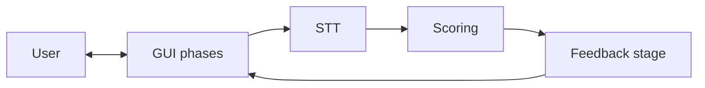

# NLP A3 — Mock Interview Coach

**[Full guide (English)](docs/en/README.md)** · **[完整說明（繁體中文）](docs/zh-TW/README.md)** · [Documentation hub](docs/README.md)

**NLP A3** is a course project for **NLP Assessment 3 (Project Development)**.  
It builds a **mock interview coaching prototype**: phased **GUI** → speech (mic; optional camera) → **open-source STT** → transcript → **scoring** (OpenAI LLM when configured, else deterministic mock) → final feedback stage back to the user.

This file is the **overview** only. Architecture, tech stack, repo layout, and collaboration notes live in the language-specific guides.

---

## At-a-glance workflow

High-level path: **User → GUI (staged flow) → STT → scoring (OpenAI LLM or mock) → feedback GUI → User.**



Optional: a backend API orchestrates STT and scoring; persistence (`DB`) is not in the current MVP.

---

## Run locally

**Frontend** (Vite dev server; proxies `/api` → port 8000):

```bash
cd frontend && npm install && npm run dev
```

**Backend** (FastAPI + faster-whisper + optional OpenAI for scoring):

From `NLP-A3`, with paths that contain **spaces** quoted:

```bash
cd backend && python3.11 -m venv .venv && source .venv/bin/activate
pip install -r requirements.txt
uvicorn app.main:app --reload --host 127.0.0.1 --port 8000
```

Full setup (venv reset, `python3` fallback, space-in-path notes) is in **[backend/README.md](backend/README.md)**.

With both running, use **Analyze recording** in the UI for real STT. Without `OPENAI_API_KEY`, scoring uses a deterministic mock. **Run demo pipeline** works with the frontend alone. See [docs/MANUAL_TEST.md](docs/MANUAL_TEST.md) for a full checklist. **STT and scoring design:** [docs/STT.md](docs/STT.md), [docs/SCORING.md](docs/SCORING.md).

---

## Documentation

| | |
|--|--|
| **English** | [docs/en/README.md](docs/en/README.md) — overview, workflow, repo layout, stack, dev workflow |
| **繁體中文** | [docs/zh-TW/README.md](docs/zh-TW/README.md) — 同上完整說明 |
| **STT** | [docs/STT.md](docs/STT.md) — faster-whisper pipeline, env, API |
| **Scoring** | [docs/SCORING.md](docs/SCORING.md) — mock vs LLM, formulas, prompts, fallbacks |

