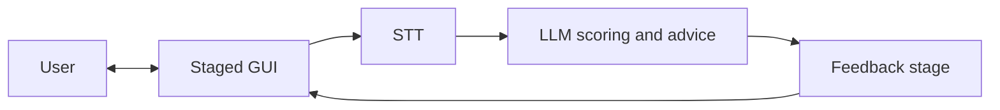

# NLP A3 — English guide

[Overview (root)](../../README.md) · **English (full guide)** · [繁體中文](../zh-TW/README.md) · [Docs hub](../README.md)

**NLP A3 — Mock Interview Coach** is a course project for **NLP Assessment 3 (Project Development)**.  
It targets a real-world problem: interview self-practice often lacks immediate, actionable feedback.

The system is a **mock interview coaching prototype** built around a **staged GUI**: users move through interview steps (prompts and guidance), enable the **microphone** (and optional **camera**) to record an answer, then **open-source STT** turns speech into a **transcript**. The transcript (plus prompt context) is sent to an **LLM** that returns **scores and written suggestions**, which are shown on a **final feedback stage** of the GUI.

Evaluation dimensions can still follow the course narrative (primarily via **LLM prompts** and optional post-processing), for example:

- STAR structure coverage (Situation / Task / Action / Result)
- prompt relevance (semantic / on-topic reasoning)
- keyword / competency coverage
- measurable evidence (numbers, percentages, duration)

The UI presents an interpretable **score breakdown** and **actionable feedback** so users can iterate and improve.

---

## User journey (product behavior)

One-liner: **User → GUI → STT → LLM → scoring → GUI → User**.

1. **Staged GUI**: step-by-step interview flow (welcome, prompt, pre-record checks, …).
2. **Recording**: user grants mic (and camera if required) and finishes a take for processing.
3. **STT**: audio becomes a **transcript**; whether the user confirms text before LLM inference is a product decision.
4. **LLM**: consumes transcript + prompt instructions and returns **structured scores and advice** (UI treatment—loading states, summaries, etc.—can be decided later).
5. **Feedback stage**: final GUI step shows scores, sub-scores, and suggestions.

---

## System workflow diagram



In practice, a **backend API** often sits between the GUI and STT/LLM for orchestration, secrets, and optional **persistence** (transcripts, scores).

---

## Architecture (components)

### Frontend (Web GUI)
- **multi-step** interview flow (state machine / wizard)
- prompt or scenario selection (as designed)
- microphone recording (MediaRecorder / Web Audio API); optional camera (getUserMedia)
- **final stage**: overall score, sub-score breakdown, LLM suggestion list (optional transcript highlights)

### Backend API (recommended)
- accept audio + prompt metadata
- orchestrate **STT → LLM** (scoring + advice) and return structured JSON for the UI
- optionally persist sessions (transcripts, scores)

### STT (open-source)
- candidates: Whisper / faster-whisper (preferred) or Vosk (lighter)

### LLM scoring and advice
- inputs: prompt / expected competencies, transcript; optional preprocessing (segmentation, normalization)
- outputs: prefer a **structured format** (e.g. JSON: per-dimension scores, short rationale, improvement bullets) for UI and reporting
- optional baselines: rules or embeddings for comparison / ablation (align with course experiments)

---

## Repository layout

```
NLP-A3/
├── README.md
├── CONTRIBUTING.md
├── .gitignore
├── frontend/          # Vite + React (staged UI, mic, API client)
├── backend/           # FastAPI: /v1/transcribe, /v1/score
├── docs/
│   ├── README.md
│   ├── MANUAL_TEST.md # manual QA checklist
│   ├── en/
│   │   └── README.md
│   └── zh-TW/
│       └── README.md
└── scripts/
```

---

## Tech stack (planned)

> Exact versions will be pinned once implementation starts.

- **Frontend**: React + Vite (audio recording via MediaRecorder / Web Audio API)
- **Backend**: FastAPI (`backend/`, faster-whisper STT; optional OpenAI JSON scoring)
- **STT (open-source)**: Whisper / faster-whisper (preferred) or Vosk
- **LLM**: hosted API or local model; structured scores + advice (pin provider/model once implementation starts)
- **NLP (optional helpers)**:
  - preprocessing: regex + lightweight tokenization / sentence splitting
  - embeddings: Sentence-Transformers (small model) for relevance baselines or ablation
- **Storage (optional)**: SQLite / JSON
- **Compute**: Google Colab (free tier) for experiments

### Run the frontend locally (Phase 1)

```bash
cd frontend && npm install && npm run dev
```

This is a **mock** path today (simulate record → STT/LLM → feedback). Real microphone + APIs land in Phase 2+.

See [MANUAL_TEST.md](../MANUAL_TEST.md) for a step-by-step QA checklist.

---

## Development workflow (suggested)

### Branching

- `main`: stable, demoable
- `feature/<name>`: feature branches
- `fix/<name>`: bug fixes

### Pull requests

- Prefer small PRs (easy review)
- Include a short summary + test notes
- Link to relevant issues (if you use GitHub Issues)

### Commit messages (suggested)

- `add STAR scoring module`
- `refine report methodology section`

### What to keep in sync (doc hygiene)

- `README.md`: overview + at-a-glance workflow diagram
- `docs/en/README.md` / `docs/zh-TW/README.md`: keep both language guides aligned with the implementation
- `CONTRIBUTING.md`: collaboration rules
- course report: keep narrative consistent with what you ship

### Suggested milestones (aligned with the end-to-end flow)

- **MVP**: staged GUI → record → STT → transcript → **LLM** scores + advice → final feedback screen
- **Deepen**: strengthen STAR / measurable-evidence dimensions via prompts or post-processing; optional embedding baselines + ablations
- **Wrap-up**: UI polish, camera if required by the brief, final report + slides

---

## Contributing

See `CONTRIBUTING.md` in the repository root.
