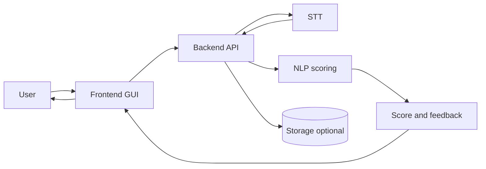

# NLP A3 — English guide

[Overview (root)](../../README.md) · **English (full guide)** · [繁體中文](../zh-TW/README.md) · [Docs hub](../README.md)

**NLP A3 — Mock Interview Coach** is a course project for **NLP Assessment 3 (Project Development)**.  
It targets a real-world problem: interview self-practice often lacks immediate, actionable feedback.

The system is a **mock interview coaching prototype** where users answer questions via speech in a web UI. The pipeline uses an **open-source STT** model to transcribe speech into text, then applies lightweight NLP methods to evaluate:

- STAR structure coverage (Situation / Task / Action / Result)
- prompt relevance (semantic similarity)
- keyword / competency coverage
- measurable evidence (numbers, percentages, duration)

It outputs an interpretable **score breakdown** and **actionable feedback** to help users iterate and improve.

---

## System workflow diagram



---

## Architecture (components)

### Frontend (Web GUI)
- prompt selection
- audio recording (MediaRecorder / Web Audio API)
- results visualization (overall score + breakdown + feedback)

### Backend API
- accept audio + prompt metadata
- orchestrate STT + NLP scoring
- optionally persist sessions (transcripts, scores)

### STT (open-source)
- candidates: Whisper / faster-whisper (preferred) or Vosk (lighter)

### NLP scoring pipeline
- preprocessing: segmentation & normalization; measurable evidence detection (numbers, durations)
- scoring signals: STAR evidence & coverage; prompt relevance (embeddings); keyword / competency coverage
- outputs: overall score, sub-scores, feedback text + evidence highlights

---

## Repository layout

```
NLP-A3/
├── README.md
├── CONTRIBUTING.md
├── .gitignore
├── docs/
│   ├── README.md
│   ├── en/
│   │   └── README.md
│   └── zh-TW/
│       └── README.md
└── scripts/
```

---

## Tech stack (planned)

> Exact versions will be pinned once implementation starts.

- **Frontend**: React + Vite (audio recording via MediaRecorder / Web Audio API)
- **Backend**: FastAPI (Python) or Express (Node.js)
- **STT (open-source)**: Whisper / faster-whisper (preferred) or Vosk
- **NLP**:
  - preprocessing: regex + lightweight tokenization / sentence splitting
  - embeddings: Sentence-Transformers (small model)
- **Storage (optional)**: SQLite / JSON
- **Compute**: Google Colab (free tier) for experiments

---

## Development workflow (suggested)

### Branching

- `main`: stable, demoable
- `feature/<name>`: feature branches
- `fix/<name>`: bug fixes

### Pull requests

- Prefer small PRs (easy review)
- Include a short summary + test notes
- Link to relevant issues (if you use GitHub Issues)

### Commit messages (suggested)

- `add STAR scoring module`
- `refine report methodology section`

### What to keep in sync (doc hygiene)

- `README.md`: overview + at-a-glance workflow diagram
- `docs/en/README.md` / `docs/zh-TW/README.md`: keep both language guides aligned with the implementation
- `CONTRIBUTING.md`: collaboration rules
- course report: keep narrative consistent with what you ship

### Suggested milestones

- MVP: prompt → record → STT → transcript → simple scoring → feedback UI
- add STAR coverage + measurable evidence detection
- add prompt relevance (embeddings) + ablation experiments
- polish UI and produce final report + slides

---

## Contributing

See `CONTRIBUTING.md` in the repository root.
