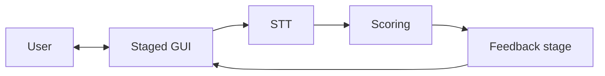

# NLP A3 — English guide

[Overview (root)](../../README.md) · **English (full guide)** · [繁體中文](../zh-TW/README.md) · [Docs hub](../README.md)

**NLP A3 — Mock Interview Coach** is a course project for **NLP Assessment 3 (Project Development)**.  
It targets a real-world problem: interview self-practice often lacks immediate, actionable feedback.

The system is a **mock interview coaching prototype** built around a **staged GUI**: users move through interview steps (prompts and guidance), enable the **microphone** (and optional **camera**) to record an answer, then **open-source STT** turns speech into a **transcript**. The transcript (plus prompt context) is sent to a **scoring backend** that returns **scores and written suggestions** (either an **OpenAI chat model** in JSON mode when `OPENAI_API_KEY` is set, or a **deterministic mock heuristic** otherwise), which are shown on a **final feedback stage** of the GUI.

**Implementation references:** [STT.md](../STT.md) (Whisper / faster-whisper) · [SCORING.md](../SCORING.md) (mock formulas, LLM prompts, fallbacks).

Evaluation dimensions follow the course narrative via **LLM system prompts** when the LLM path is active; the mock path shares the same four rubric labels but scores them with a **lightweight NLP stack** (keywords, structure cues, fluency/fillers, confidence heuristics — see SCORING). Example dimensions:

- STAR structure coverage (Situation / Task / Action / Result)
- prompt relevance (semantic / on-topic reasoning)
- keyword / competency coverage
- measurable evidence (numbers, percentages, duration)

The UI presents an interpretable **score breakdown** and **actionable feedback** so users can iterate and improve.

---

## User journey (product behavior)

One-liner: **User → GUI → STT → scoring (LLM or mock) → GUI → User**.

1. **Staged GUI**: step-by-step interview flow (welcome, prompt, pre-record checks, …).
2. **Recording**: user grants mic (and camera if required) and finishes a take for processing.
3. **STT**: audio becomes a **transcript**; whether the user confirms text before scoring is a product decision.
4. **Scoring**: backend consumes transcript + question fields and returns **structured scores and advice** (`source`: `llm` or `mock`). See [SCORING.md](../SCORING.md).
5. **Feedback stage**: final GUI step shows scores, sub-scores, and suggestions.

---

## System workflow diagram



In practice, a **backend API** sits between the GUI and STT/scoring for orchestration and secrets; optional **persistence** is not in the current MVP.

---

## Architecture (components)

### Frontend (Web GUI)
- **multi-step** interview flow (state machine / wizard)
- prompt or scenario selection (as designed)
- microphone recording (MediaRecorder / Web Audio API); optional camera (getUserMedia)
- **final stage**: overall score, sub-score breakdown, suggestion list (optional transcript highlights)

### Backend API (FastAPI)
- accept audio + prompt metadata
- orchestrate **STT → score** and return structured JSON for the UI (`/v1/transcribe`, `/v1/score`)
- persistence is optional (not implemented in MVP)

### STT (implemented)
- **faster-whisper** (Whisper weights) on CPU by default; details in [STT.md](../STT.md).

### Scoring (implemented)
- **LLM path:** OpenAI Chat Completions, `response_format: json_object`, STAR-aligned system prompt (or `minimal` variant via env).  
- **Mock path:** reproducible heuristic when no API key or on LLM failure — see [SCORING.md](../SCORING.md).  
- **Experiments:** [ABLATION.md](../ABLATION.md); batch CSV helper may live in sibling `NLP-A3-exp/` if your monorepo includes it.

---

## Repository layout

```
NLP-A3/
├── README.md
├── CONTRIBUTING.md
├── .gitignore
├── frontend/          # Vite + React (staged UI, mic, API client)
├── backend/           # FastAPI: STT + /v1/score; NLP mock lives in app/nlp/
├── docs/
│   ├── README.md
│   ├── STT.md           # STT pipeline (canonical)
│   ├── SCORING.md       # scoring module (canonical)
│   ├── ABLATION.md      # experiment notes
│   ├── MANUAL_TEST.md   # manual QA checklist
│   ├── en/
│   │   └── README.md
│   └── zh-TW/
│       └── README.md
└── scripts/
```

---

## Tech stack (as implemented)

- **Frontend**: React + Vite + **Tailwind CSS v4** (UI from `NLP/A3/ref-figma`; recording via MediaRecorder)
- **Backend**: FastAPI — `backend/` (`faster-whisper` STT; OpenAI JSON scoring when key present, else **`app/nlp` lightweight NLP mock**)
- **STT**: see [STT.md](../STT.md)
- **Scoring**: see [SCORING.md](../SCORING.md)
- **Optional / future**: embeddings baselines, persistence — not required for current MVP

### Run locally

**Frontend:**

```bash
cd frontend && npm install && npm run dev
```

**Backend** (STT + score API): see [backend/README.md](../../backend/README.md).

Full QA: [MANUAL_TEST.md](../MANUAL_TEST.md).

---

## Development workflow (suggested)

### Branching

- `main`: stable, demoable
- `feature/<name>`: feature branches
- `fix/<name>`: bug fixes

### Pull requests

- Prefer small PRs (easy review)
- Include a short summary + test notes
- Link to relevant issues (if you use GitHub Issues)

### Commit messages (suggested)

- `add STAR scoring module`
- `refine report methodology section`

### What to keep in sync (doc hygiene)

- `README.md`: overview + at-a-glance workflow diagram
- `docs/STT.md` / `docs/SCORING.md`: canonical behaviour for STT and scoring (keep in sync with `backend/app/*.py`)
- `docs/en/README.md` / `docs/zh-TW/README.md`: keep both language guides aligned with the implementation
- `CONTRIBUTING.md`: collaboration rules
- course report: keep narrative consistent with what you ship

### Suggested milestones (aligned with the end-to-end flow)

- **MVP**: staged GUI → record → STT → transcript → **scoring** (LLM or mock) → final feedback screen
- **Deepen**: strengthen STAR / measurable-evidence dimensions via prompts or post-processing; optional embedding baselines + ablations
- **Wrap-up**: UI polish, camera if required by the brief, final report + slides

---

## Contributing

See `CONTRIBUTING.md` in the repository root.
