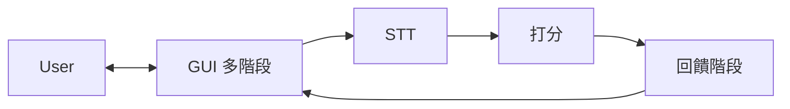

# NLP A3 — 繁體中文說明

[總覽（根目錄）](../../README.md) · [English](../en/README.md) · **繁體中文（完整說明）** · [文件索引](../README.md)

**NLP A3 — Mock Interview Coach** 是 **NLP 作業三（Project Development）** 的專題倉庫。  
我們要解決的真實問題是：面試自我練習常常缺少「即時、具體、可執行」的回饋。

本專案是一個 **模擬面試教練原型**：使用者在 **分階段 GUI** 中依序看到題目與引導、開啟麥克風（與可選的鏡頭）錄製回答；系統以 **開源 STT** 將語音轉成文字後，將 **逐字稿與題目** 交給後端 **打分模組**（已設定 `OPENAI_API_KEY` 時為 **OpenAI Chat JSON**；否則為 **可重現的 mock 啟發式**），產出 **分數與文字建議**，並在 **回饋畫面** 呈現。

**實作說明（canonical）：** [STT.md](../STT.md)（Whisper / faster-whisper）· [SCORING.md](../SCORING.md)（mock 公式、LLM prompt、fallback）。

評估面向在 **LLM 路徑** 下由 **system prompt** 對齊 STAR 等敘述；**mock 路徑** 僅使用固定維度標籤，分數本質為 **字長／數字** 等啟發式（詳見 SCORING）。例如：

- STAR 結構覆蓋（Situation / Task / Action / Result）
- 題目相關度（語意／論述是否扣題）
- 關鍵字 / 能力項覆蓋
- 可量化證據（數字、百分比、時間長度等）

輸出為可解釋的 **分數拆解** 與 **可操作的改進建議**，讓使用者能反覆修正、追蹤進步。

---

## 使用者歷程（產品行為）

一句話：**User → GUI → STT → scoring（LLM 或 mock）→ GUI → User**。

1. **GUI 多階段**：依面試流程分步呈現（例如歡迎、題目說明、錄音前檢查……），使用者主要在網頁上「跟著階段走」。
2. **錄製**：使用者開啟麥克風（與若需要的鏡頭），完成錄音後交由系統處理。
3. **STT**：音訊轉成 **文字（transcript）**；是否在畫面上先給使用者確認再送打分，可由產品決定。
4. **打分**：後端以 transcript 與題目欄位產出 **結構化分數與建議**（`source`：`llm` 或 `mock`）。見 [SCORING.md](../SCORING.md)。
5. **回饋階段**：在最後一個 GUI 階段顯示分數、子項與建議，使用者讀完即完成一輪。

---

## 系統流程圖



實務上由 **Backend API** 在 GUI 與 STT／打分之間編排請求與金鑰；目前 MVP **未**實作持久儲存。

---

## 系統架構（元件）

### Frontend（Web GUI）
- **分階段**面試流程（狀態／wizard）
- 題目或情境選擇（依設計）
- 麥克風錄音（MediaRecorder / Web Audio API）；鏡頭（getUserMedia）若產品需要
- **最終階段**：總分、子分數拆解、建議列表（可搭配逐字稿 highlight）

### Backend API（FastAPI）
- 接收音訊與題目 metadata
- 串接 **STT** → **打分**（`/v1/transcribe`、`/v1/score`），回傳結構化 JSON
- 持久化為可選（目前 MVP 未實作）

### STT（已實作）
- **faster-whisper**（Whisper 權重），預設 CPU。細節見 [STT.md](../STT.md)。

### 打分模組（已實作）
- **LLM 路徑：** OpenAI Chat Completions、`json_object` 輸出、STAR 向 system prompt（或環境變數 `minimal` 變體）。
- **Mock 路徑：** 無 API 金鑰或 LLM 失敗時之 **可重現啟發式** — [SCORING.md](../SCORING.md)。
- **實驗：** [ABLATION.md](../ABLATION.md)；批次 CSV 可見同層 monorepo 的 `NLP-A3-exp/`（若有）。

---

## 專案結構

```
NLP-A3/
├── README.md
├── CONTRIBUTING.md
├── .gitignore
├── frontend/          # Vite + React（分階段 UI、錄音、呼叫 API）
├── backend/           # FastAPI：/v1/transcribe、/v1/score
├── docs/
│   ├── README.md
│   ├── STT.md           # STT 管線（canonical）
│   ├── SCORING.md       # 打分模組（canonical）
│   ├── ABLATION.md      # 實驗對照筆記
│   ├── MANUAL_TEST.md   # 手動測試清單
│   ├── en/
│   │   └── README.md
│   └── zh-TW/
│       └── README.md
└── scripts/
```

---

## 技術選型（目前實作）

- **Frontend**：React + Vite + **Tailwind CSS v4**（`NLP/A3/ref-figma`；MediaRecorder）
- **Backend**：FastAPI — `backend/`（faster-whisper STT；有金鑰時 OpenAI JSON 打分，否則 mock）
- **STT**：見 [STT.md](../STT.md)
- **打分**：見 [SCORING.md](../SCORING.md)
- **可選／未來**：embedding 對照、持久化 — 非目前 MVP 必要

### 本機執行

**前端：**

```bash
cd frontend && npm install && npm run dev
```

**後端：** 見 [backend/README.md](../../backend/README.md)。

完整手動測試：[MANUAL_TEST.md](../MANUAL_TEST.md)。

---

## 開發流程（建議）

### 分支策略

- `main`：穩定、可 demo
- `feature/<name>`：功能分支
- `fix/<name>`：修 bug

### Pull Request

- 盡量小 PR（好 review）
- 附上摘要 + 測試方式
- 若有 issue 請連結

### Commit message（建議）

- `add STAR scoring module`
- `refine report methodology section`

### 文件同步（維持乾淨）

- `README.md`：總覽 + 一張流程圖（at-a-glance）
- `docs/STT.md` / `docs/SCORING.md`：與 `backend/app/*.py` 行為一致
- `docs/en/README.md` / `docs/zh-TW/README.md`：中英文完整說明要跟實作一致
- `CONTRIBUTING.md`：協作規範
- 課程報告：敘述要跟交付內容一致

### 建議里程碑（與端到端流程對齊）

- **MVP**：GUI 分階段 → 錄音 → STT → transcript → **打分**（LLM 或 mock）→ 最終回饋畫面
- **加深**：STAR／量化證據等維度在 prompt 或後處理中強化；可選 embedding 對照 + ablation
- **收尾**：UI polish、鏡頭（若需要）、final report + slides

---

## 協作規範

請見 repo 根目錄的 `CONTRIBUTING.md`。
