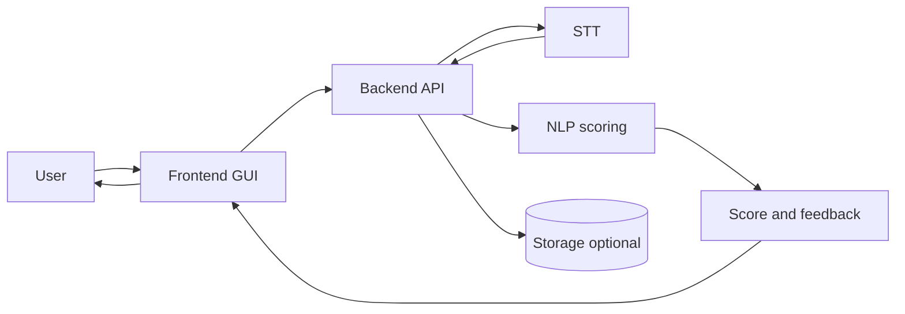

# NLP A3 — 繁體中文說明

[總覽（根目錄）](../../README.md) · [English](../en/README.md) · **繁體中文（完整說明）** · [文件索引](../README.md)

**NLP A3 — Mock Interview Coach** 是 **NLP 作業三（Project Development）** 的專題倉庫。  
我們要解決的真實問題是：面試自我練習常常缺少「即時、具體、可執行」的回饋。

本專案是一個 **模擬面試教練原型**：使用者在網頁 UI 以語音回答題目，系統透過 **開源 STT** 將語音轉成文字，再用輕量 NLP 方法評估：

- STAR 結構覆蓋（Situation / Task / Action / Result）
- 題目相關度（語意相似度）
- 關鍵字 / 能力項覆蓋
- 可量化證據（數字、百分比、時間長度等）

最後輸出可解釋的 **分數拆解** 與 **可操作的改進建議**，讓使用者能反覆修正、追蹤進步。

---

## 系統流程圖（Mermaid）

> GitHub 的 Markdown 支援 Mermaid 渲染。



---

## 專案結構

```
NLP-A3/
├── README.md
├── CONTRIBUTING.md
├── .gitignore
├── docs/
│   ├── README.md
│   ├── ARCHITECTURE.md
│   ├── DEVELOPMENT.md
│   ├── en/
│   │   └── README.md
│   └── zh-TW/
│       └── README.md
└── scripts/
```

---

## 技術選型（規劃中）

> 實作開始後會把版本與依賴鎖定。

- **Frontend**：React + Vite（錄音：MediaRecorder / Web Audio API）
- **Backend**：FastAPI（Python）或 Express（Node.js）
- **STT（開源）**：Whisper / faster-whisper（優先）或 Vosk
- **NLP**：
  - 前處理：regex + 輕量斷句 / tokenization
  - embeddings：Sentence-Transformers（小模型）
- **Storage（可選）**：SQLite / JSON
- **Compute**：Google Colab（免費額度）做實驗

---

## 開發流程（建議）

### 分支策略

- `main`：穩定、可 demo
- `feature/<name>`：功能分支
- `fix/<name>`：修 bug

### Pull Request

- 盡量小 PR（好 review）
- 附上摘要 + 測試方式
- 若有 issue 請連結

### Commit message（建議）

- `add STAR scoring module`
- `refine report methodology section`

---

## 其他文件

- `docs/ARCHITECTURE.md`：系統元件與介面
- `docs/DEVELOPMENT.md`：協作與里程碑
