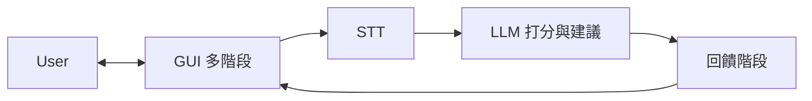

# NLP A3 — 繁體中文說明

[總覽（根目錄）](../../README.md) · [English](../en/README.md) · **繁體中文（完整說明）** · [文件索引](../README.md)

**NLP A3 — Mock Interview Coach** 是 **NLP 作業三（Project Development）** 的專題倉庫。  
我們要解決的真實問題是：面試自我練習常常缺少「即時、具體、可執行」的回饋。

本專案是一個 **模擬面試教練原型**：使用者在 **分階段 GUI** 中依序看到題目與引導、開啟麥克風（與可選的鏡頭）錄製回答；系統以 **開源 STT** 將語音轉成文字後，將 **逐字稿與題目脈絡** 交給 **LLM** 產出 **分數與文字建議**，並在 **最後一個階段（回饋畫面）** 呈現給使用者。

評估面向仍可比照課程敘述設計（實作上主要由 LLM 依 prompt 涵蓋），例如：

- STAR 結構覆蓋（Situation / Task / Action / Result）
- 題目相關度（語意／論述是否扣題）
- 關鍵字 / 能力項覆蓋
- 可量化證據（數字、百分比、時間長度等）

輸出為可解釋的 **分數拆解** 與 **可操作的改進建議**，讓使用者能反覆修正、追蹤進步。

---

## 使用者歷程（產品行為）

一句話：**User → GUI → STT → LLM → scoring → GUI → User**。

1. **GUI 多階段**：依面試流程分步呈現（例如歡迎、題目說明、錄音前檢查……），使用者主要在網頁上「跟著階段走」。
2. **錄製**：使用者開啟麥克風（與若需要的鏡頭），完成錄音後交由系統處理。
3. **STT**：音訊轉成 **文字（transcript）**；是否在畫面上先給使用者確認再送 LLM，可由產品決定。
4. **LLM**：以 transcript（與題目、STAR 等指令）產出 **結構化分數與建議**（具體 UI 呈現方式可後續定：例如僅結果、或處理中狀態／摘要等）。
5. **回饋階段**：在最後一個 GUI 階段顯示分數、子項與建議，使用者讀完即完成一輪。

---

## 系統流程圖



實務上可在 GUI 與 STT／LLM 之間加上 **Backend API** 編排請求、金鑰與可選的 **儲存（逐字稿、分數）**。

---

## 系統架構（元件）

### Frontend（Web GUI）
- **分階段**面試流程（狀態／wizard）
- 題目或情境選擇（依設計）
- 麥克風錄音（MediaRecorder / Web Audio API）；鏡頭（getUserMedia）若產品需要
- **最終階段**：總分、子分數拆解、LLM 建議列表（可搭配逐字稿 highlight）

### Backend API（建議）
- 接收音訊與題目 metadata
- 串接 **STT** → **LLM**（打分與建議），回傳結構化 JSON 供前端渲染
- 可選：儲存 session（逐字稿、分數）

### STT（開源）
- 候選：Whisper / faster-whisper（優先）或 Vosk（較輕量）

### LLM 評分與建議
- 輸入：題幹／期望能力、transcript；可選前處理（斷句、正規化）
- 輸出：建議以 **結構化格式**（例如 JSON：各維度分數、短評、改進重點）便於 UI 與報告
- 可選輔助：規則或 embedding 作對照／ablation（與課程實驗敘述一致即可）

---

## 專案結構

```
NLP-A3/
├── README.md
├── CONTRIBUTING.md
├── .gitignore
├── frontend/          # Vite + React（分階段 UI、錄音、呼叫 API）
├── backend/           # FastAPI：/v1/transcribe、/v1/score
├── docs/
│   ├── README.md
│   ├── MANUAL_TEST.md # 手動測試清單
│   ├── en/
│   │   └── README.md
│   └── zh-TW/
│       └── README.md
└── scripts/
```

---

## 技術選型（規劃中）

> 實作開始後會把版本與依賴鎖定。

- **Frontend**：React + Vite（錄音：MediaRecorder / Web Audio API）
- **Backend**：FastAPI（`backend/`，faster-whisper STT；可選 OpenAI 結構化打分）
- **STT（開源）**：Whisper / faster-whisper（優先）或 Vosk
- **LLM**：API 或本機模型；輸出結構化分數與建議（實作後鎖定供應商與模型）
- **NLP（可選輔助）**：
  - 前處理：regex + 輕量斷句 / tokenization
  - embeddings：Sentence-Transformers（小模型），用於相關度對照或 ablation
- **Storage（可選）**：SQLite / JSON
- **Compute**：Google Colab（免費額度）做實驗

### 本機跑前端（Phase 1）

```bash
cd frontend && npm install && npm run dev
```

目前為 **mock** 錄音完成 → 模擬 STT/LLM → 回饋畫面；真實麥克風與 API 於 Phase 2 起接入。

手動測試步驟見 [MANUAL_TEST.md](../MANUAL_TEST.md)。

---

## 開發流程（建議）

### 分支策略

- `main`：穩定、可 demo
- `feature/<name>`：功能分支
- `fix/<name>`：修 bug

### Pull Request

- 盡量小 PR（好 review）
- 附上摘要 + 測試方式
- 若有 issue 請連結

### Commit message（建議）

- `add STAR scoring module`
- `refine report methodology section`

### 文件同步（維持乾淨）

- `README.md`：總覽 + 一張流程圖（at-a-glance）
- `docs/en/README.md` / `docs/zh-TW/README.md`：中英文完整說明要跟實作一致
- `CONTRIBUTING.md`：協作規範
- 課程報告：敘述要跟交付內容一致

### 建議里程碑（與端到端流程對齊）

- **MVP**：GUI 分階段 → 錄音 → STT → transcript → **LLM** 打分與建議 → 最終回饋畫面
- **加深**：STAR／量化證據等維度在 prompt 或後處理中強化；可選 embedding 對照 + ablation
- **收尾**：UI polish、鏡頭（若需要）、final report + slides

---

## 協作規範

請見 repo 根目錄的 `CONTRIBUTING.md`。
